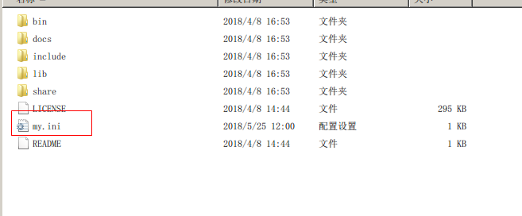
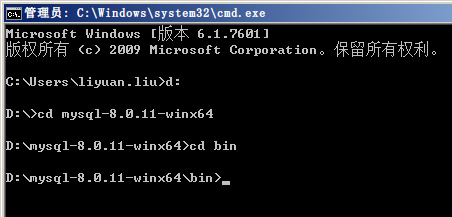
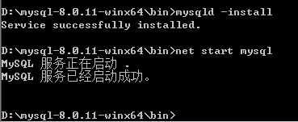
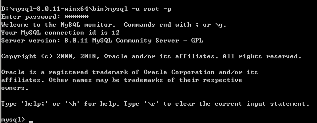
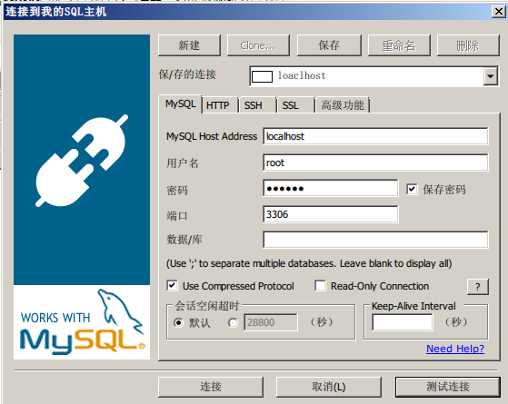
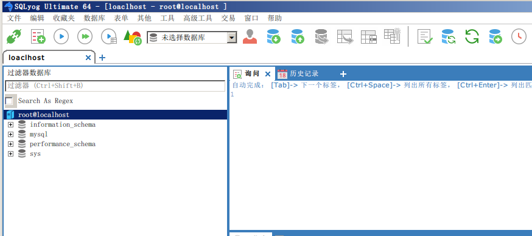

# mysql

## MySQL8.0安装步骤

**一、下载MySQL8.0**

这个没啥好说的了吧，去官网下好，下下来解压


**二、设置环境变量**

本不想说明怎么设置环境变量，但是为了广大初学者，还是写详细点

1.打开我的电脑，在计算机上右键，属性（我是win7啊，win10的自己去网上百度下，环境变量在哪里吧）


2.点高级系统设置


3.高级->环境变量


4.新建


5.输入你mysql解压出来的目录/bin（我是解压到d盘了），点确定


6.编辑Path变量


7.将刚才的MYSQL_HOME变量添加进去，点确定（注意在最前面输入的是%MYSQL_HONE%;）


这样环境变量就设置好了

**三、在解压目录下，添加my.ini文件**

 在里面添加如下信息

按 Ctrl+C 复制代码

按 Ctrl+C 复制代码



**四、数据库初始化**

按键盘的win+R，输入cmd，打开命令窗口

切换到刚才解压mysql的bin目录下（别问我怎么切换。。）



自动生成root用户

mysqld --initialize-insecure


**五、安装**

还在上面的目录下 

安装服务：

mysqld -install

启动服务：

net start mysql



连接mysql

mysql -u root


OK！到这里就已经启动好了

停止服务

net stop mysql

注意一下，如果需要卸载服务，重新安装，需要将mysql解压目录里的data文件夹里的东西清空

然后输入

mysqld -remove

 **六、更换密码**

刚才安装完，进入mysql是不需要密码的，实际中肯定是不行的，现在要登录mysql后设置密码

首先：ALTER USER 'root'@'localhost' IDENTIFIED BY 'password' PASSWORD EXPIRE NEVER; #修改加密规则 接着：ALTER USER 'root'@'localhost' IDENTIFIED WITH mysql_native_password BY '123456'; #更新一下用户的密码为123456最后：FLUSH PRIVILEGES; #刷新权限 

以后登录就需要输入密码了



用sqlyog连接





## mysql连接数

**（连接总数、活跃数、最大并发数）**

```sql
show variables like ``'%max_connection%'``; 查看最大连接数
set global max_connections=1000;        重新设置最大连接数
```

```sql
mysql> show status like  'Threads%';
+-------------------+-------+
| Variable_name     | Value |
+-------------------+-------+
| Threads_cached    | 32    |
| Threads_connected | 10    |
| Threads_created   | 50    |
| Threads_rejected  | 0     |
| Threads_running   | 1     |
+-------------------+-------+
5 rows in set (0.00 sec)
```

**Threads_connected ：这个数值指的是打开的连接数.**

**Threads_running ：这个数值指的是激活的连接数**，这个数值一般远低于connected数值.

Threads_connected 跟show processlist结果相同，表示当前连接数。准确的来说，Threads_running是代表当前并发数

查询数据库当前设置的最大连接数

```sql
mysql> show variables like '%max_connection%';
+-----------------------+-------+
| Variable_name         | Value |
+-----------------------+-------+
| extra_max_connections |       |
| max_connections       | 2512  |
+-----------------------+-------+
2 rows in set (0.00 sec)
```

在/etc/my.cnf里面设置数据库的最大连接数

[mysqld]

max_connections = 1000 

MySQL服务器的线程数需要在一个合理的范围之内，这样才能保证MySQL服务器健康平稳地运行。**Threads_created表示创建过的线程数**，通过查看Threads_created就可以查看MySQL服务器的进程状态。

```sql
mysql> show global status like 'Thread%';
+-------------------------+-------+
| Variable_name           | Value |
+-------------------------+-------+
| Threadpool_idle_threads | 0     |
| Threadpool_threads      | 0     |
| Threads_cached          | 29    |
| Threads_connected       | 13    |
| Threads_created         | 50    |
| Threads_rejected        | 0     |
| Threads_running         | 1     |
+-------------------------+-------+
7 rows in set (0.00 sec)
```

如果我们在MySQL服务器配置文件中设置了**thread_cache_size**，当客户端断开之后，服务器处理此客户的线程将会缓存起来以响应下一个客户而不是销毁(前提是缓存数未达上限)。

Threads_created表示创建过的线程数，如果发现Threads_created值过大的话，表明MySQL服务器一直在创建线程，这也是比较耗资源，可以适当增加配置文件中thread_cache_size值，查询服务器thread_cache_size的值：

```sql
mysql> show variables like 'thread_cache_size';
+-------------------+-------+
| Variable_name     | Value |
+-------------------+-------+
| thread_cache_size | 100   |
+-------------------+-------+
1 row in set (0.00 sec)
```

命令：show processlist; 
如果是root帐号，你能看到所有用户的当前连接。如果是其它普通帐号，只能看到自己占用的连接。 
show processlist命令只列出前100条，如果想全列出请使用show full processlist; 

```sql
mysql> show processlist;
```

命令：show status;

```sql
mysql>show status like '%变量名%';
```

变量名如下：
Aborted_clients 由于客户没有正确关闭连接已经死掉，已经放弃的连接数量。 
Aborted_connects 尝试已经失败的MySQL服务器的连接的次数。 
Connections 试图连接MySQL服务器的次数。 
Created_tmp_tables 当执行语句时，已经被创造了的隐含临时表的数量。 
Delayed_insert_threads 正在使用的延迟插入处理器线程的数量。 
Delayed_writes 用INSERT DELAYED写入的行数。 
Delayed_errors 用INSERT DELAYED写入的发生某些错误(可能重复键值)的行数。 
Flush_commands 执行FLUSH命令的次数。 
Handler_delete 请求从一张表中删除行的次数。 
Handler_read_first 请求读入表中第一行的次数。 
Handler_read_key 请求数字基于键读行。 
Handler_read_next 请求读入基于一个键的一行的次数。 
Handler_read_rnd 请求读入基于一个固定位置的一行的次数。 
Handler_update 请求更新表中一行的次数。 
Handler_write 请求向表中插入一行的次数。 
Key_blocks_used 用于关键字缓存的块的数量。 
Key_read_requests 请求从缓存读入一个键值的次数。 
Key_reads 从磁盘物理读入一个键值的次数。 
Key_write_requests 请求将一个关键字块写入缓存次数。 
Key_writes 将一个键值块物理写入磁盘的次数。 
Max_used_connections 同时使用的连接的最大数目。 
Not_flushed_key_blocks 在键缓存中已经改变但是还没被清空到磁盘上的键块。 
Not_flushed_delayed_rows 在INSERT DELAY队列中等待写入的行的数量。 
Open_tables 打开表的数量。 
Open_files 打开文件的数量。 
Open_streams 打开流的数量(主要用于日志记载） 
Opened_tables 已经打开的表的数量。 
Questions 发往服务器的查询的数量。 
Slow_queries 要花超过long_query_time时间的查询数量。 
Threads_connected 当前打开的连接的数量。 
Threads_running 不在睡眠的线程数量。 
Uptime 服务器工作了多长时间，单位秒。