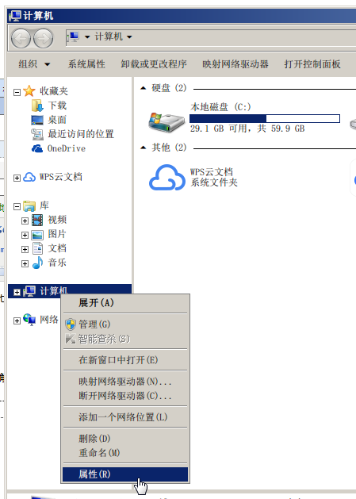
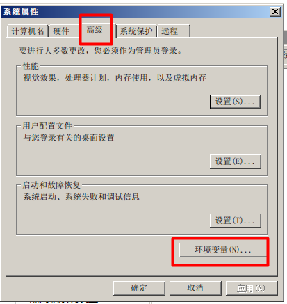
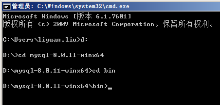

**一、下载MySQL8.0**

这个没啥好说的了吧，去官网下好，下下来解压

**二、设置环境变量**

本不想说明怎么设置环境变量，但是为了广大初学者，还是写详细点

1.打开我的电脑，在计算机上右键，属性（我是win7啊，win10的自己去网上百度下，环境变量在哪里吧）

2.点高级系统设置

3.高级->环境变量

4.新建

5.输入你mysql解压出来的目录/bin（我是解压到d盘了），点确定

6.编辑Path变量

7.将刚才的MYSQL_HOME变量添加进去，点确定（注意在最前面输入的是%MYSQL_HONE%;）

这样环境变量就设置好了

**三、在解压目录下，添加my.ini文件**

 在里面添加如下信息

按 Ctrl+C 复制代码

按 Ctrl+C 复制代码

**四、数据库初始化**

按键盘的win+R，输入cmd，打开命令窗口

切换到刚才解压mysql的bin目录下（别问我怎么切换。。）

自动生成root用户

mysqld --initialize-insecure

**五、安装**

还在上面的目录下 

安装服务：

mysqld -install

启动服务：

net start mysql

连接mysql

mysql -u root

OK！到这里就已经启动好了

停止服务

net stop mysql

注意一下，如果需要卸载服务，重新安装，需要将mysql解压目录里的data文件夹里的东西清空

然后输入

mysqld -remove

 **六、更换密码**

刚才安装完，进入mysql是不需要密码的，实际中肯定是不行的，现在要登录mysql后设置密码

首先：ALTER USER 'root'@'localhost' IDENTIFIED BY 'password' PASSWORD EXPIRE NEVER; #修改加密规则 接着：ALTER USER 'root'@'localhost' IDENTIFIED WITH mysql_native_password BY '123456'; #更新一下用户的密码为123456最后：FLUSH PRIVILEGES; #刷新权限 

以后登录就需要输入密码了

用sqlyog连接

