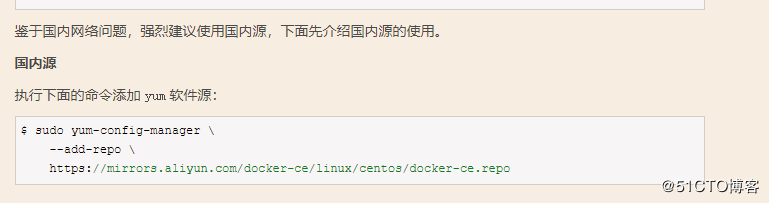
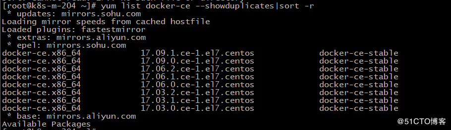
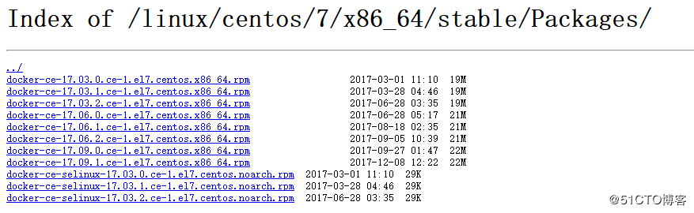

Centos7安装docker社区(CE)版

官网指导：https://docs.docker.com/engine/installation/linux/docker-ce/centos/#install-docker-ce-1

**法一：yum安装**

**#** 安装依赖包yum install -y yum-utils device-mapper-persistent-data lvm2**#** 添加Docker软件包源yum-config-manager --add-repo https://download.docker.com/linux/centos/docker-ce.repo**#**关闭测试版本list（只显示稳定版）sudo yum-config-manager --enable docker-ce-edgesudo yum-config-manager --enable docker-ce-test**#** 更新yum包索引yum makecache fast**#**NO.1 直接安装Docker CE （will always install the highest  possible version，可能不符合你的需求）yum install docker-ce**#**NO.2 指定版本安装yum list docker-ce --showduplicates|sort -r  yum install docker-ce-17.09.0.ce -y

**#** 启动systemctl start docker**#** 测试docker run hello-worlddocker version**#** 卸载yum remove docker-cerm -rf /var/lib/docker

**法二：rpm包手动安装（无网络环境）**

*#官网下载rpm包*https://download.docker.com/linux/centos/7/x86_64/stable/Packages

**#**上传服务器，安装yum install  /path/安装包.rpm**#** 启动systemctl start docker**#** 测试docker run hello-worlddocker version**#**升级（下载新版本包）yum upgrade  /path/新版本.rpm

**法三：官方提供一键安装脚本\**（不推荐生产环境使用！）**

用于开发环境快速安装，不提供版本选择，总是安装最新的**edg**版和**test**版脚本需要**root**权限执行不要在已经用其他方式安装**docker** 的服务器上使用脚本安装**get**.docker.com 总是安装**DockerCE** 的**edge**最新版本；（**edg**版，每月更新的版本，新特性，**bug**多）# **curl-fsSLget**.docker.com**-oget-docker**.sh# **sudoshget-docker**.sh**test**.docker.com 总是安装**DockerCE** 的**test**最新版本# **curl-fsSLtest**.docker.com**-otest-docker**.sh# **sudoshtest-docker**.sh

https://blog.51cto.com/11887934/2050590