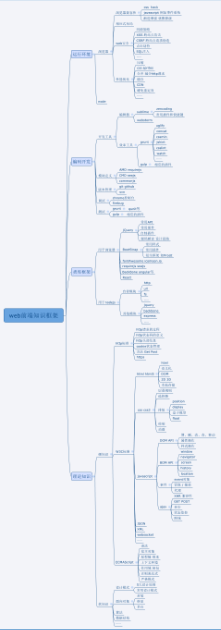

# 自己总结的web前端知识体系大全

[**自己总结的web前端知识体系大全【欢迎补充】**](https://www.cnblogs.com/wangfupeng1988/p/4649709.html)

**1. 前言**

　　大约在几个月之前，让我看完了《webkit技术内幕》这本书的时候，突然有了一个想法。想把整个web前端开发所需要的知识都之中在一个视图中，形成一个完整的web前端知识体系，**目的是想要颠覆人们对于前端只有三大块（html、css、js）的认识——做web前端需要的比这三大块要多得多**。

　　拖了好几个月了，但是由于近期将要参加的某一个活动，我不得不这两天把这个东西整出来。说干就干。上午我就开始在办公室画草图，乱七八糟的在那儿理思路。

　　

　　大家不要害怕，其实下文中的这个知识框架要比草图中的好看的多，草图大家权当没看见。

　　好了，废话不扯。下面请跟随我本博客的内容，来看看web前端开发除了htm、css和js之外，还有哪些东西需要你一步一步去掌握。

　　

　　在看内容之前，先看一下这个知识框架的预览图。图太大不好展示，看不清除，可在此下载清晰版**：**[**http://pan.baidu.com/s/1hqIUvUc**](http://pan.baidu.com/s/1gdEq0VL) **（内有整个知识体系的图片和xmind文件）**

　　

**2. 分类**

　　所有知识框架，那肯定是一个结构型的展现，就是一棵树。web前端的知识点非常多，也非常散，需要好几层结构来组织这个体系，否则就会显得很乱。那么如何组织、把谁和谁放在一块儿？这是真正值得我们去思考的，你也可以自己来思考一下这个问题。

　　在我总结的这个知识框架中，首先第一层我划分为：**理论知识，类库框架，编码开发，运行环境**。如下图：

　　

　　接下来给大家解释一下：

　　这个图要**从下往上**看，为何？——因为下面是上面的基础；

- 首先，我们需要一定的理论知识，不管是你听别人讲授、自己看书还是网上淘资料，你都需要一定的理论知识，每一种程序开发，都避免不了。
- 第二，有了这些理论知识我们就可以编码了——不错——but，没有人能抵挡住第三方框架和类库的诱惑，例如jquery；
- 第三，有了这些理论知识和协助我们的类库框架，我们就可真正的编码了。大家可能以为编码开发不就是写代码吗，还有啥？——这里面道道多着呢；
- 最后，开发程序的目的，最终是为了能高效、稳定的运行在相应的环境中，这其中又有哪些事情需要我们去做？请期待；

**3. 理论知识 包括“软知识”和“硬知识”**

　　“软知识”和“硬知识”大家可能觉得词陌生，其实我一说大家就能明白。

　　

- 所谓“软”的就是能在各个程序开发中都用到的，算是基本功、内功，例如数据结构、算法、设计模式、面向对象等等；
- 所谓“硬”的就是能直接用于本程序开发的。用C语言你就得学C语言语法，此时学java没用。我们web前端开发所需要的硬知识其实都包含在三个标准里面：**http标准、W3C标准和ECMAScript标准**；

**4. 聊一聊web前端开发中的“硬知识”**

　　“软知识”的内容非常多，也是我们大学时代学习的重点（没学好是另回事儿，毕业再恶补）。我们本次主要讨论的是web前端这一个方向，因此就点到为止，让大家知道这些知识也在知识体系中扮演重要角色。

　　刚才说道，硬知识有三个标准：**http标准、W3C标准和ECMAScript标准**，那咱们就挨个聊聊这三个标准。

**4.1 http标准**

　　为什么做web前端要了解http标准？——因为浏览器要从服务端获取网页，网页也可能将信息再提交给服务器，这其中都有http的连接。web系统既然和http链接有瓜葛，你就必须去了解它。

　　

　　我的意见是：你不必去非常了解http的详细内容，但是你要了解web前端开发常用的一些http的知识——就是上图中我列出来的那些。当然，我知识列了一个纲，详细内容还得靠你自己去查阅（本文章讲的是知识框架，不会涉