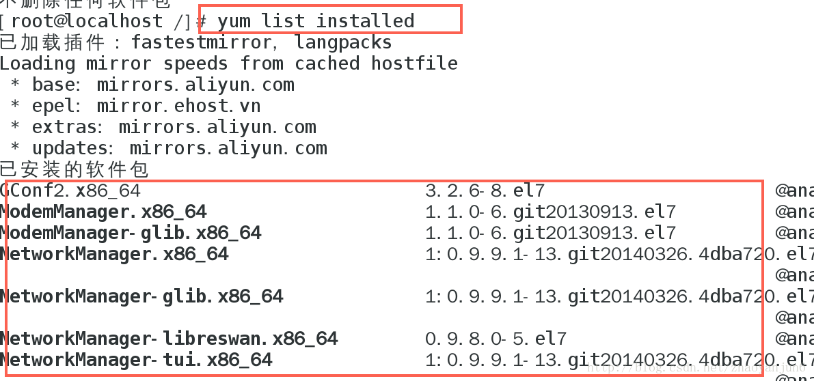
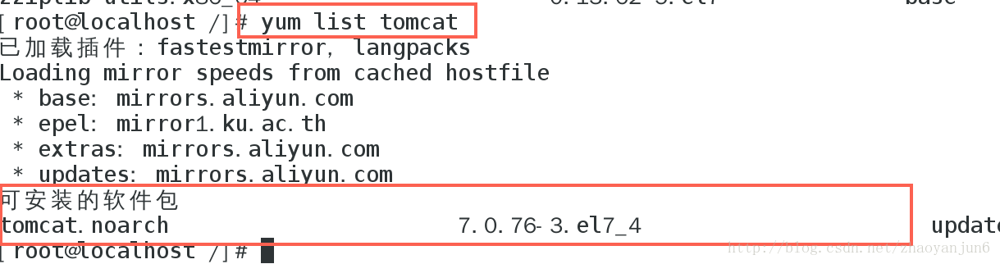
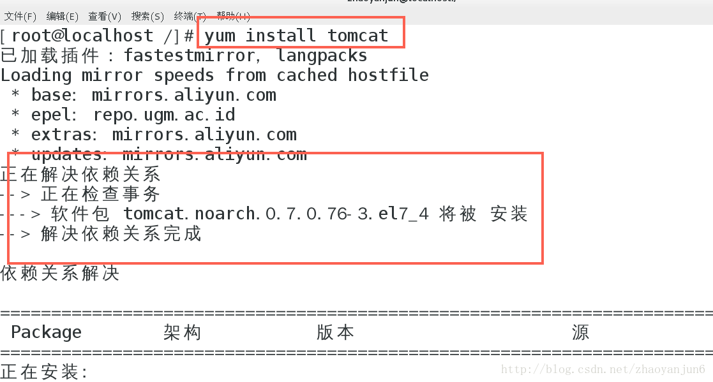
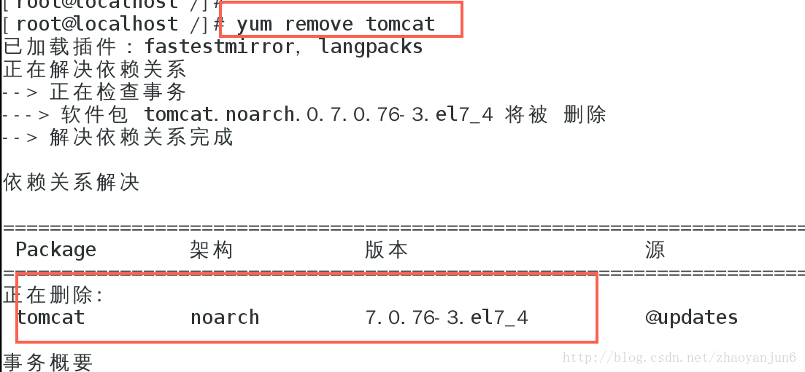
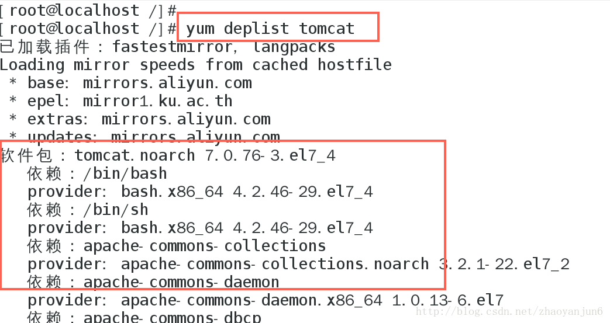
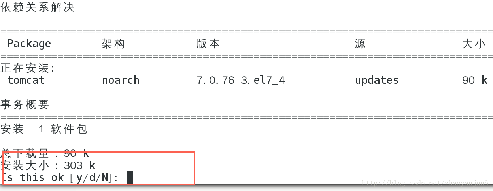
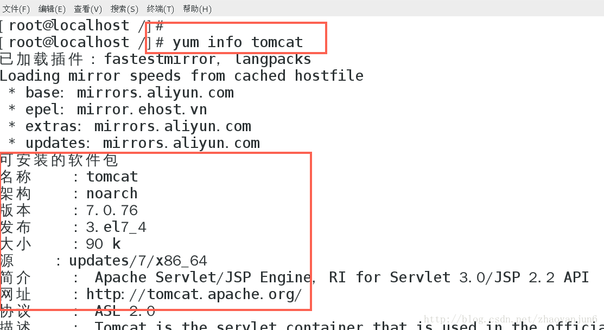
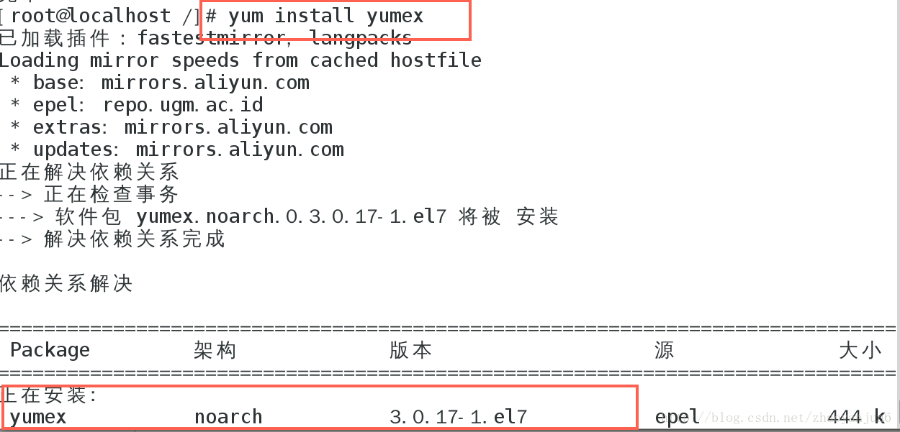
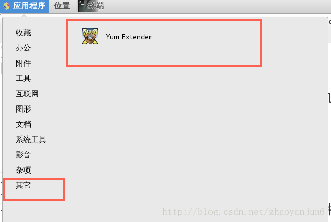
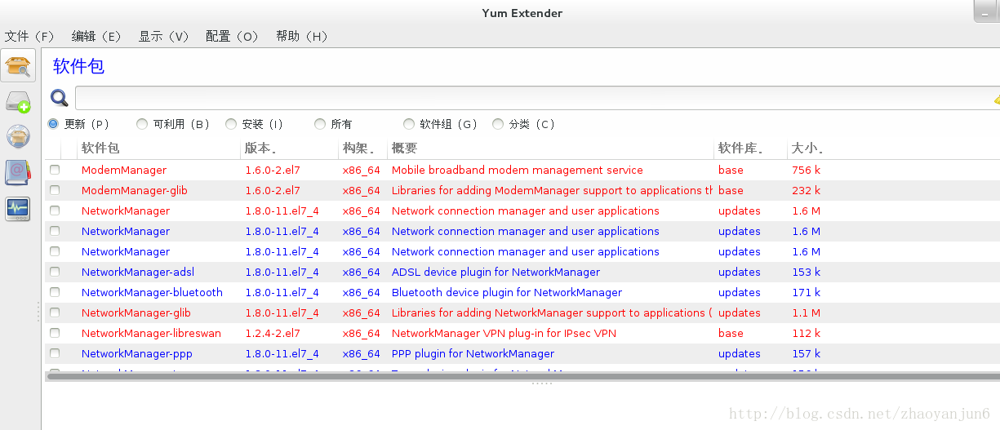

# CentOS 初体验三： Yum 安装、卸载软件

**一：Yum 简介**

Yum（全称为 Yellow dog Updater, Modified）是一个在[Fedora](https://www.baidu.com/s?wd=Fedora&tn=24004469_oem_dg&rsv_dl=gh_pl_sl_csd)和RedHat以及CentOS中的Shell前端软件包管理器。基于RPM包管理，能够从指定的[服务器](https://www.baidu.com/s?wd=服务器&tn=24004469_oem_dg&rsv_dl=gh_pl_sl_csd)自动下载RPM包并且安装，可以自动处理依赖性关系，并且一次安装所有依赖的软件包，无须繁琐地一次次下载、安装。

**二：常用的 Yum 命令**

**1、显示已经安装的软件包**

yum list installed

**2、查找可以安装的软件包 （以 tomcat 为例）**

yum list tomcat

**3、安装软件包 （以 tomcat 为例）**

yum install tomcat

**4、卸载软件包 （以 tomcat 为例）**

yum remove tomcat

**5、列出软件包的依赖 （以 tomcat 为例）**

yum deplist tomcat

**6、-y 自动应答yes**

在安装软件的时候，会有中断，让用户选择是否要继续，如下图：

我们可以用 -y 来应答所有的 yes , 比如我们安装 tomcat 的时候，用下面的命令，将安装任务[一气呵成](https://www.baidu.com/s?wd=一气呵成&tn=24004469_oem_dg&rsv_dl=gh_pl_sl_csd)，不会中断。

yum -y install tomcat

**7、info 显示软件包的描述信息和概要信息**

以 tomcat 为例

yum info tomcat

**8、升级软件包**

升级所有的软件包

yum update

升级某一个软件包 ，以升级 tomcat 为例

yum update tomcat

检查可更新的程序

yum check-update

**三： Yum 可视化图形界面 Yumex**

yum Extender (简称 yumex ) , 是 yum 的图形化操作界面。可以通过 yumex 方便的查看软件包，安装、卸载软件包。对于对命令行不熟的人简直就是神奇，管理软件包很方便。

**1、yumex 安装**

yum install yumex

**2、打开 yumex**

打开后的 yumex 界面如下：

