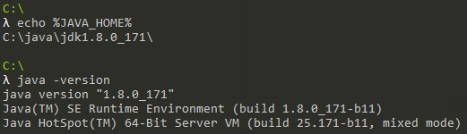
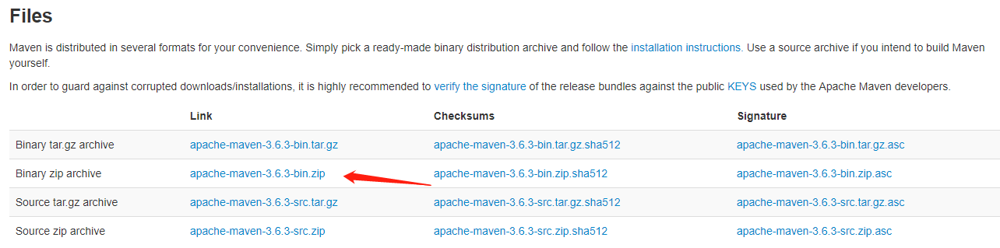
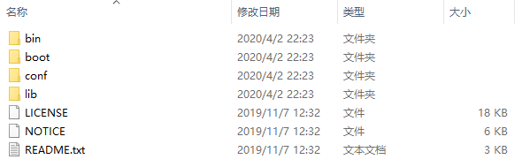
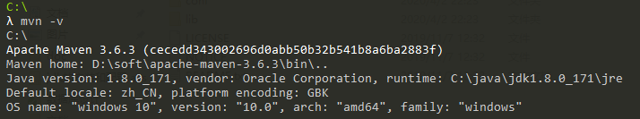
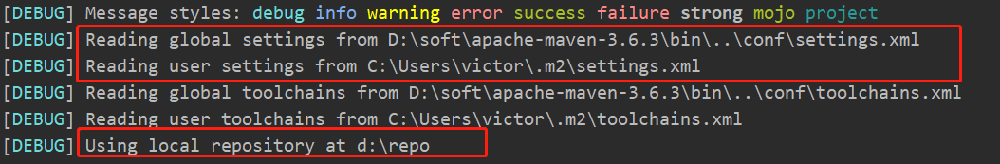

# maven安装和配置


##  windows

### 检查

确认已经安装jdk并配置JAVA_HOME，Path

在CMD命令行中输入echo %JAVA_HOME%，查看JAVA_HOME是否配置。在CMD命令行中输入java -version，查看jdk是否正确安装。



### maven下载

1. 下载地址：https://maven.apache.org/download.cgi

2. 选择相应的版本，点击下载。



### 解压

将文件解压到D:\soft\apache-maven-3.6.3目录下:




### 配置环境变量

我的电脑->右键->属性->高级系统设置->环境变量->系统变量

1. 新建**M2_HOME**值为D:\soft\apache-maven-3.6.3
2. 编辑环境变量**Path**，新建%M2_HOME%\bin

### 检验是否安装成功

运行cmd命令



### 配置文件

#### settings.xml文件的存储位置

* `${M2_HOME}/conf/settings.xml`，全局配置
* `${user.home}/.m2/settings.xml`，用户配置
* 当这两个文件同时存在的时候，相同的配置信息用户配置会覆盖全局配置中的定义。
* 项目下执行命令查看配置文件位置及仓库位置

```powershell
mvn clean -X
```



#### settings元素解析
参考：[Maven全局配置文件settings.xml详解](https://www.cnblogs.com/hongmoshui/p/10762272.html)

* LocalRepository

  作用：该值表示构建系统本地仓库的路径。
  其默认值：~/.m2/repository。

  ```xml
  <localRepository>${user.home}/.m2/repository</localRepository>
  ```

  可修改为

  ```xml
  <localRepository>d:/repo</localRepository>
  ```

* servers
  作用：一般，仓库的下载和部署是在pom.xml文件中的repositories 和 distributionManagement 元素中定义的。然而，一般类似用户名、密码（有些仓库访问是需要安全认证的）等信息不应该在pom.xml文件中配置，这些信息可以配置在 settings.xml 中。

  ```xml
  <servers>
    <server>
      <!--这是server的id（注意不是用户登陆的id），该id与distributionManagement中repository元素的id相匹配。 -->
      <id>server001</id>
      <!--鉴权用户名。鉴权用户名和鉴权密码表示服务器认证所需要的登录名和密码。 -->
      <username>my_login</username>
      <!--鉴权密码 。鉴权用户名和鉴权密码表示服务器认证所需要的登录名和密码。密码加密功能已被添加到2.1.0 +。详情请访问密码加密页面 -->
      <password>my_password</password>
    </server>
  </servers>
  ```

  
