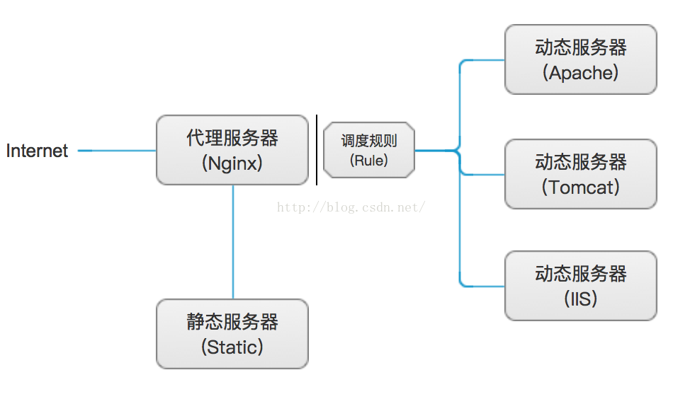
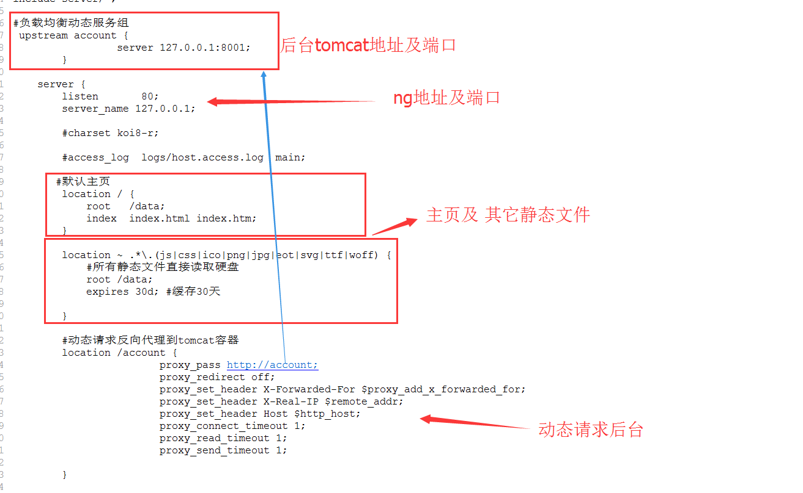
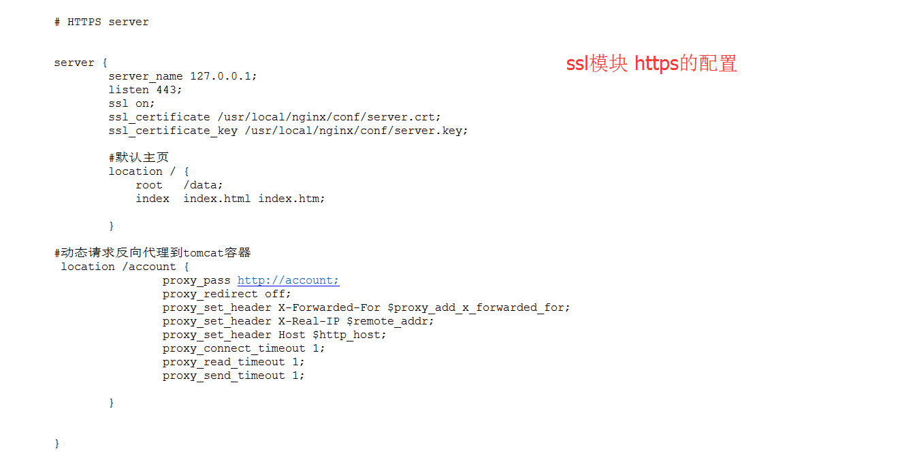
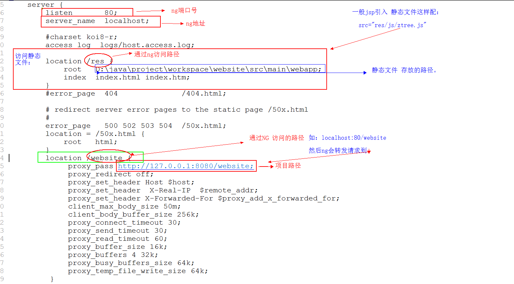
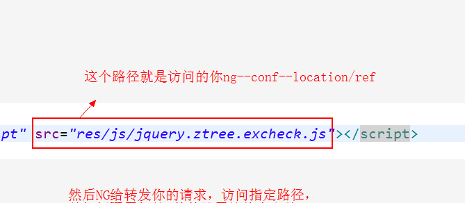
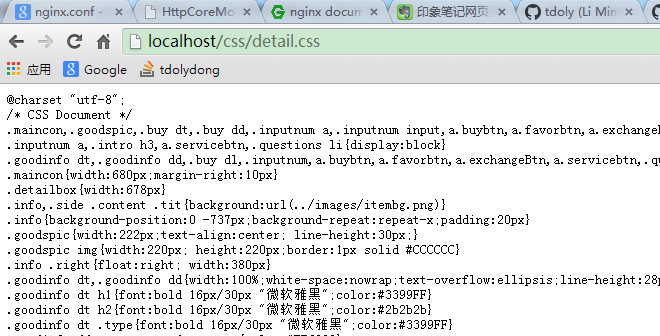
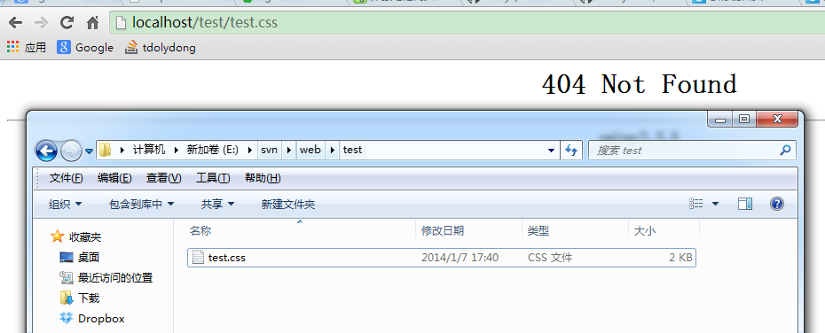

# nginx 静态文件

原理：

 

说明：

1、代理服务器和静态服务器即为一台服务器上，这里只是为了明显区分动静分离所处服务器的不同；

2、静态服务器中，存放的资源主要是源代码文件、图片、属性、样式以及其它所有非动态的资源文件；

3、调度规则，即为代理服务器，这里是Nginx的服务器调度规则；

4、动态服务器，其种类比较繁多，可以是Apache、Tomcat、IIS以及其它Web服务器，它们一般分别隶属于一台服务器；

 

二、实现

1、实现说明

如上图所示，当客户端访问代理服务器时：

首先，加载和显示存放在静态服务器中的静态资源，这里以html为例；

其次，如果上一步没有匹配对应的资源，我们就认为是动态访问请求，那么就直接访问参与负载均衡的服务器列表中的某一台服务器的动态操作；

最后，Nginx作为Web服务器加载静态资源（html、css、[**js**](http://lib.csdn.net/base/javascript)、image），而静态资源如果需要动态获取数据，并填充到页面显示，会自动去往负载服务器获取并返回，在实现了动态分离的同时，也参与了服务器的负载均衡。

**conf中的配置：**

**一、**

**（其实如果index与css等文件在同一目录之下，就只配置主页location即可）**

二、

**1：通过 ng 的 conf文件中配置项目的访问地址，然后通过ng访问；**

**2：项目中需要引用静态文件，也是直接配置ng中路径，访问具体文件夹下的静态文件；**

**3：引入静态文件，不需要添加根目录，它会自动通过ng访问，ng会解析静态文件；**

**例如：**

**当然访问路径可以配置模糊路径：**

 **如：**        **location** **~ ^****/(images|javascript|js|css|flash|media|static)/**  **{          root        E:\svn\web;          access_log  off;          expires     30d;        }**

主要是在server监控的80端口下新增一个location来指定静态文件路径，location 这个指令允许根据URI进行不同的配置。它可以使用字符串和正则表达式进行配置。如果使用正则，就必须使用前缀。

1. “~” 匹配时区分大小写
2. “~*” 匹配时不区分大小写
3. “=” 精确匹配字符和字符串
4. “^~” 例如： ^~ /images/ 匹配到任何以images开头的，便停止搜索。

location ~ ^/(images|javascript|js|css|flash|media|static)/ { #请求的根文档 root E:\svn\web; #过期时间 expires 30d; }

这里的location匹配以images等开头的路径。如果文件路径不存在，会提示404错误。例如:http://localhost:80/css/detail.css。会找到E:\svn\web\css\detail.css

可以正常访问到文件。

http://localhost:80/test/test.css。会提示404，虽然存在这个E:\svn\web\test\test.css文件。

**负载均衡-用nginx+keepalive解决单点故障与热备**