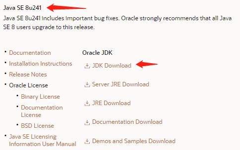
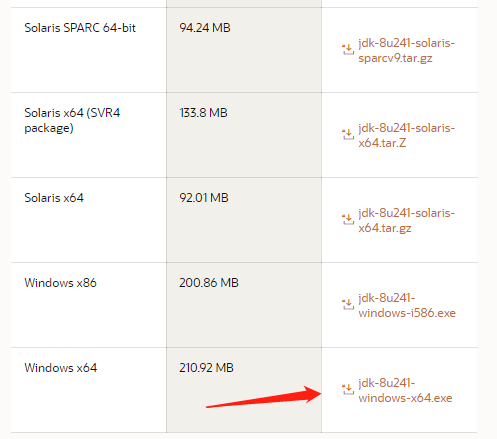
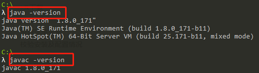

# jdk的安装和配置

##  windows

### jdk下载

1. 下载地址：https://www.oracle.com/java/technologies/javase-downloads.html

2. 选择要下载的jdk版本

3. 根据操作系统选择相应的版本，点击下载

### 安装

点击安装文件安装，安装过程中会出现两次安装目录提示。jdk目录修改为C:\java\jdk1.8.0_171，jre目录修改为C:\java\jre1.8.0_171

:warning:目录不要包含中文和空格,否则运行程序可能报错

### 配置环境变量

可以配置在用户变量或环境变量。

我的电脑->右键->属性->高级系统设置->环境变量->系统变量

1. 新建**JAVA_HOME**值为C:\java\jdk1.8.0_171
2. 新建**CLASSPATH**值为C:\java\jre1.8.0_171(jdk1.5后可以不配置)
3. 修改**Path**，新建%JAVA_HOME%\bin
4. 确定保存

### 校验安装及配置情况

运行cmd命令

