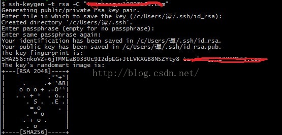
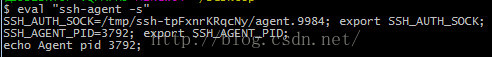
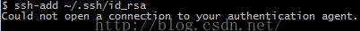
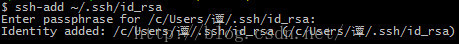
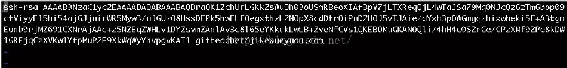
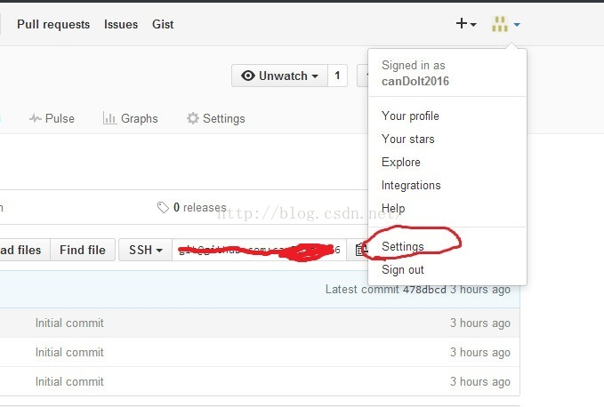
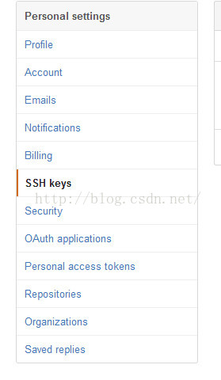
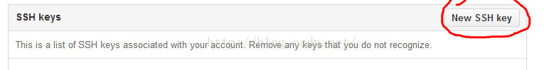
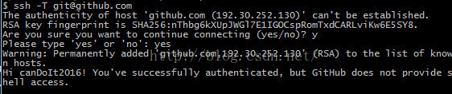

## ssh key

一、引子：

什么是ssh：ssh是Secure Shell（安全外壳协议）的缩写，建立在应用层和传输层基础上的安全协议。为了便于访问github，要生成ssh公钥，这样就不用每一次访问github都要输入用户名和密码。

二、生成条件：

请在github上先注册账号，本地安装git。

三、生成步骤：

1、本地成功安装了git后，单击鼠标右键，选择Git Bush here，打开git bush。

2、 键入命令：ssh-keygen -t rsa -C "email@email.com"，引号中是你在github上的注册邮箱，之后设定你的ssh密码，如图：

3、第二步已经成功的生成了ssh key，再输入eval  "ssh-agent -s"，如图：

4、再输入ssh-add ~/.ssh/id_rsa，再输入你设定的ssh的密码，在输入ssh-add ~/.ssh/id_rsa可能会产生“could not open a connection to your authentication agent”错误，如图：

这时直接输入：ssh-agent bash，再输入ssh-add ~/.ssh/id_rsa就可以，如图：

5、将key添加到github账户中去：

1）用vim复制key的内容：vim ~/.ssh/id_rsa.pub，右键复制出现的内容，如图：

2）添加到github中

找到setting中的ssh keys，如图：

将刚才的复制的keys粘贴即可。

6、测试：

输入ssh -T git@gitub.com，如图，说明已经完成。

## 参考

[GitLab配置ssh key](https://www.cnblogs.com/hafiz/p/8146324.html)

