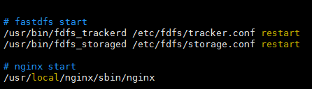

[**nginx + fastdfs 的开机自启动**](https://www.cnblogs.com/yufeng218/p/8215381.html)

虚拟机每次启动之后都要重新启动一下fastdfs 和 nginx服务，比较麻烦，所以增加开机自启动；

编辑 /etc/rc.d/rc.local 文件，增加启动项；

1、编辑文件

```shell
 vim /etc/rc.d/rc.local
```

 2、增加如下：

```shell
# fastdfs start /usr/bin/fdfs_trackerd /etc/fdfs/tracker.conf restart /usr/bin/fdfs_storaged /etc/fdfs/storage.conf restart # nginx start /usr/local/nginx/sbin/nginx 
```



3、在centos7中, /etc/rc.d/rc.local 文件的权限被降低了，需要给rc.local 文件增加可执行的权限；

chmod +x /etc/rc.d/rc.local

服务检测

/usr/bin/fdfs_monitor /etc/fdfs/storage.conf