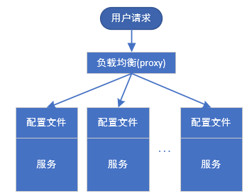
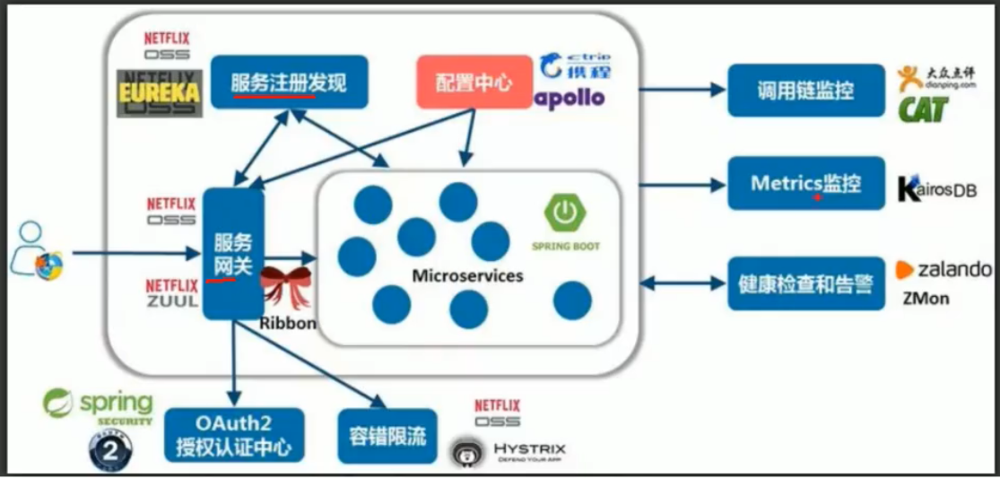
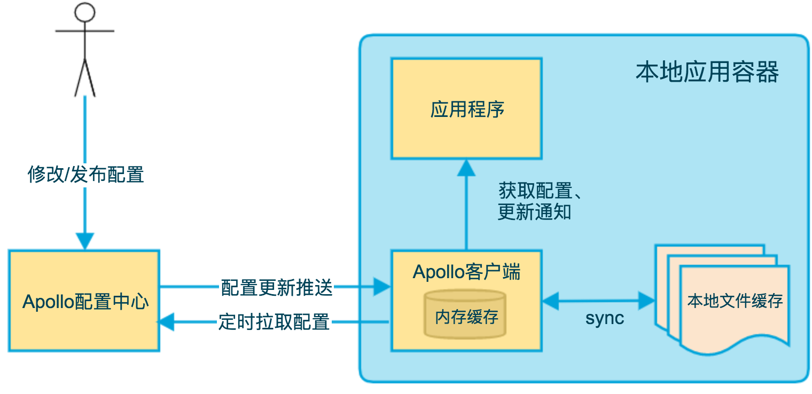
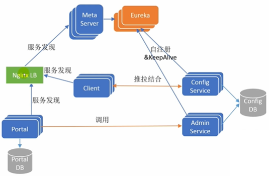

# 分布式配置中心

## 概览

### 什么是配置

应用程序在启动和运行的时候往往需要读取一些配置信息，配置基本上伴随着应用程序的整个生命周期，比如：数据库连接参数、启动参数等。

配置主要有一下几个特点：

* **配置是独立于程序的只读变量**
  * 配置首先是独立于程序的，同一份程序在不同的配置下会有不同的行为
  * 其次，配置对于程序是只读的，程序通过读取配置来改变自己的行为，但是程序不应该去改变配置
  
* **配置伴随应用的整个生命周期**
  * 配置贯穿于应用的整个生命周期，应用在启动时通过读取配置来初始化，在运行时根据配置调整行为，比如：启东时需要读取服务的端口号、系统在运行过程中需要读取定时策略等。
  
* **配置可以有多种加载方式**

  * 常见的有程序内部硬编码，配置文件，环境变量，启动参数，基于数据库等
  
* **配置需要治理**

  * 权限控制：由于配置能改变程序的行为，不正确的配置甚至能一起灾难，所以对配置的修改必须有比较完善的权限控制
  * 不同环境、集群配置管理：同一份程序在不同的环境(开发，测试，生产)、不同的集群(如不同的数据中心)经常需要有不同的配置，所以需要有完善的环境、集群配置管理
  
### 什么是配置中心
​		传统单体应用存在一些潜在缺陷，如随着规模的扩大，部署效率低，团队协作效率差，系统可靠性变差，维护困难，新功能上线周期长等，所以迫切需要一种新的架构去解决这些问题，为微服务(microservices)架构正是当下一种流行的解法。

  ​	不过，解决一个问题的同事，往往会诞生很多新的问题，所以微服务化的过程中伴随着很多的挑战，其中一个挑战就是有关服务(应用)配置的。当系统从一个单体应用，被拆分成分布式系统上一个个服务节点后，配置文件也必须跟着迁移(分割)，这样配置就分散了，不仅如此，分撒中还包含着冗余，如下图：

配置中心将配置从应用中剥离出来，统一管理，优雅的解决了配置的动态变更、持久化、运维成本等问题。应用自身既不需要去添加管理配置接口，也不需要自己去实现配置的持久化，更不需要引入"定时任务"以便降低运维成本。

​		**总的来说，配置中心就是一种统一管理各种应用配置的基础服务组件。**

​		在系统架构中，配置中心是整个微服务基础架构体系的一个组件，如下图，它的功能看上去并不起眼，无非就是配置的管理和存取，但它是整个微服务架构中不可或缺的一环。

​		集中管理配置，那么就要将应用的配置作为一个单独的服务抽离出来了，同理也需要解决新的问题，比如：版本管理(为了支持回滚)，权限管理等。

总结一下，在传统巨型单体应用纷纷转向细粒度微服务架构的历史进程中，配置中心是微服务化不可或缺的一个系统组件，在这种背景下中心化的配置服务即配置中心应运而生，一个合格的配置中心需满足：

* 配置项容易读取和修改

* 添加新的配置简单直接

* 支持对配置的修改的检视以把控风险

* 可以查看配置修改的历史记录

* 不同部署环境支持隔离

### 主流配置中心

目前市面上面用的比较多的配置中心有：(按开源时间排序)

1. Disconf

   2014年7月百度开源的配置管理中心，专注于各种「分布式系统配置管理」的「通用组件」和「通用平台」, 提供统一的「配置管理服务」

   https://github.com/knightliao/disconf

   https://disconf.readthedocs.io/zh_CN/latest/

    [分布式配置管理平台Disconf](https://disconf.readthedocs.io/zh_CN/latest/design/src/%E5%88%86%E5%B8%83%E5%BC%8F%E9%85%8D%E7%BD%AE%E7%AE%A1%E7%90%86%E5%B9%B3%E5%8F%B0Disconf.html)

2. Spring Cloud Config

   2014年9月开源,Spring Cloud生态组件，可以和Spring Cloud体系无缝整合。

   https://github.com/spring-cloud/spring-cloud-config

3. Apollo

   2016年5月开源，Apollo（阿波罗）是携程框架部门研发的分布式配置中心，能够集中化管理应用不同环境、不同集群的配置，配置修改后能够实时推送到应用端，并且具备规范的权限、流程治理等特性，适用于微服务配置管理场景

   https://github.com/ctripcorp/apollo

   [Apollo配置中心介绍](https://github.com/ctripcorp/apollo/wiki/Apollo配置中心介绍)

4. Nacos

   2018年6月，阿里开源的配置中心，也可以做DNS和RPC的服务发现。
   
   https://nacos.io/zh-cn/index.html
   
   https://github.com/alibaba/nacos
   
   ### 各配置中心共对比
   
   Disconf不再维护不做对比
   
   | 功能点       | Spring Cloud           | Apollo                   | Nacos                    |
   | ------------ | ---------------------- | ------------------------ | ------------------------ |
   | 配置实时推送 | 支持(Spring Cloud Bus) | 支持(HTTP长轮训1s内)     | 支持(HTTP长轮训1s内)     |
   | 版本管理     | 支持(Git)              | 支持                     | 支持                     |
   | 配置回滚     | 支持(Git)              | 支持                     | 支持                     |
   | 灰度发布     | 支持                   | 支持                     | 不支持                   |
   | 权限管理     | 支持                   | 支持                     | 不支持                   |
   | 多集群       | 支持                   | 支持                     | 支持                     |
   | 多环境       | 支持                   | 支持                     | 支持                     |
   | 监听查询     | 支持                   | 支持                     | 支持                     |
   | 多语言       | 只支持java             | 主流语言，提供了Open APi | 主流语言，提供了Open APi |
   | 配置格式校验 | 不支持                 | 支持                     | 支持                     |
   | 单机读(QPS)  | 7(限流所致)            | 9000                     | 15000                    |
   | 单机写(QPS)  | 5(限流所致)            | 1100                     | 1800                     |
   | 3节点读(QPS) | 21(限流所致)           | 27000                    | 45000                    |
   | 3节点写(QPS) | 5(限流所致)            | 3300                     | 5600                     |
   
   

## Apollo

### Apollo简介

https://github.com/ctripcorp/apollo

[Apollo配置中心介绍](https://github.com/ctripcorp/apollo/wiki/Apollo配置中心介绍)

### Apollo基础模型

Apollo包括服务端和客户端两部分：

服务端基于Spring Boot和Spring Cloud开发，打包后可以直接运行。

如下即是Apollo的基础模型：

1. 用户在配置中心对配置进行修改并发布
2. 配置中心通知Apollo客户端有配置更新
3. Apollo客户端从配置中心拉取最新的配置、更新本地配置并通知到应用

### 客户端设计

### Apollo核心概念

**application (应用)**

**environment (环境)**

**cluster (集群)**

**namespace (命名空间)**

### Apollo总体设计

#### 架构视图1

#### 架构视图2

### Apollo安装过程

https://github.com/spring2go/apollo_lab/tree/master/lab01

### 参考

[分布式部署指南]([https://github.com/ctripcorp/apollo/wiki/%E5%88%86%E5%B8%83%E5%BC%8F%E9%83%A8%E7%BD%B2%E6%8C%87%E5%8D%97](https://github.com/ctripcorp/apollo/wiki/分布式部署指南))

[Apollo源码解析（全）](http://www.iocoder.cn/categories/Apollo/)

