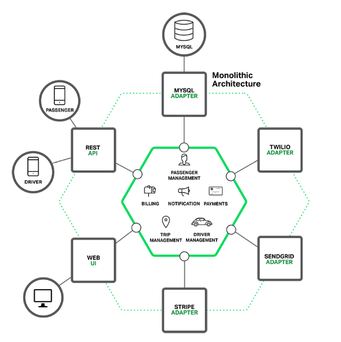
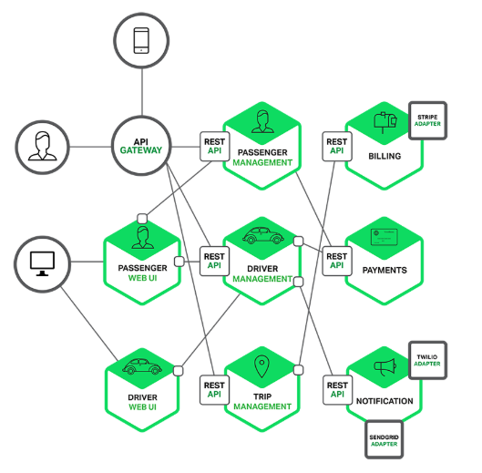

# 单体应用VS微服务

## 单体应用架构概念

​		一个归档包（可以是JAR、WAR、EAR或其它归档格式）包含所有功能的应用程序，通常称为单体应用。
而架构单体应用的方法论，就是单体应用架构。

## 单体架构示意图

## 单体应用架构的优缺点

1. 优点

* 容易开发

* 容易测试

* 容易部署

2. 缺点

* 随着时间推移而变得**越来越臃肿**。

* 敏捷开发和交付的任何一次尝试都将**原地徘徊**。

* 应用的规模也将减缓发展。 应用越大， **启动时间越长**。  

* 复杂的单体应用本身就是**持续部署的障碍**。

* 当不同模块存在资源需求冲突时， 单体应用可能会难以扩展。

* 单体应用的另一个问题是**可靠性**。 因为所有模块都运行在同一进程中。 任何模块的一个 bug， 比如内存泄漏，   都可能会拖垮整个进程。  

## 微服务架构概念

​		微服务架构风格是一种将一个单一应用程序开发为一组小型服务的方法，每个服务运行在自己的进程中，服务间通信采用轻量级通信机制。这些服务围绕业务能力构建并且可通过全自动部署机制独立部署。这些服务共用一个最小型的集中式的管理，服务可用不同的语言开发，使用不同的数据存储技术。

## 微服务架构示意图

## 微服务架构的优缺点

1. 优点

  解决了复杂问题。

  每个服务都可以由一个团队独立专注开发。

  实现每个微服务独立部署。

  每个服务能够独立扩展。   

2. 缺点

* 微服务是一个分布式系统， 其使得整体变得复杂。

* 分区数据库架构。分布式事务最终一致性。

* 测试微服务应用也很复杂。

* 跨越多服务变更。

* 部署基于微服务的应用也是相当复杂的。

## 总结
​		构建复杂的微服务应用本质上是困难的。 单体架构模式只适用于简
  单、 轻量级的应用， 如果你使用它来构建复杂应用， 你最终会陷入
  痛苦的境地。 对于复杂、 持续发展的应用而言， 微服务架构模式是
  一个更好的选择。 尽管它存在着缺点和挑战。  